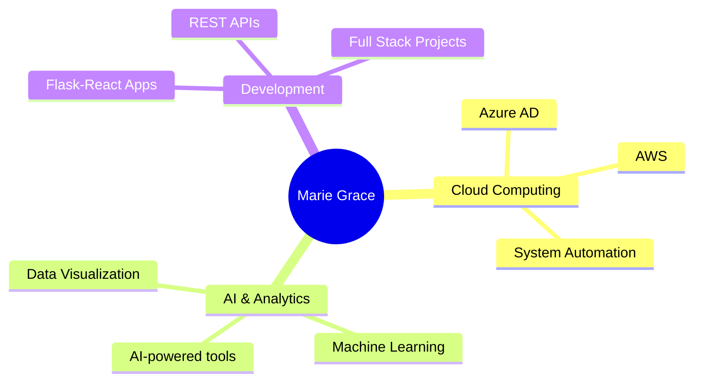

# 👋 Hi there, I'm Marie Grace Kagaju

---

## 🚀 About Me

**📍 Location:** Rwanda  
**💼 Current Role:** Technical Support Engineer @ TEKNOWLEDGE  
**🗣️ Languages:** English 🇬🇧 | French 🇫🇷 (Beginner) | Kinyarwanda 🇷🇼

I'm a dedicated IT professional with a passion for:
- 💡 Solving real-world problems with technology
- 🌐 Building scalable web applications
- 📊 Turning data into actionable insights

**🎯 Current Focus:** Cloud computing & AI-powered analytics

**✨ My Philosophy:** Technology isn't just about systems — it's about empowering people through innovation.

## 🛠️ Tech Stack

### Languages

### Frameworks & Libraries

### Databases

### Tools & Platforms

### Backend Tools & Extensions

---

## 💼 Featured Projects

<table>
<tr>
<td width="50%">

### 🏠 Café Fausse Web App
A full-stack café management system with real-time reservations, dynamic menu management, and contact forms.

**Tech Stack:**
- Frontend: React, TypeScript
- Backend: Flask, PostgreSQL
- Deployment: Vercel

</td>
<td width="50%">

### 📊 Data Analytics Portfolio
Collection of data analysis projects featuring data cleaning, visualization, and business intelligence insights.

**Tech Stack:**
- Python (Pandas, NumPy)
- Power BI
- Excel

</td>
</tr>
<tr>
<td width="50%">

### 🧩 IT Support Automation
Scripts and utilities to automate troubleshooting, system checks, and daily IT operations.

**Tech Stack:**
- Python
- Bash
- REST APIs

</td>
<td width="50%">

### 🚧 Coming Soon
Building a new Flask-React full-stack application with AI-powered features.

**Stay tuned!** ⭐

</td>
</tr>
</table>

---

## 📜 Certifications

| 🎓 Certification | 🏆 Area |
|:----------------|:--------|
| Software Development Certificate | Development |
| IT Professional Certification | IT Support |
| CCNA | Networking |
| Business Analytics | Analytics |
| Data Analytics | Data Science |

---

## 📈 GitHub Stats

---

## 🌱 Current Focus

---

## 🤝 Let's Connect!

I'm always open to interesting conversations, collaboration opportunities, and new projects!

### 💭 Quote I Live By

> *"Technology isn't just about systems — it's about empowering people through innovation."*

---

**⭐️ From [kagajugrace](https://github.com/kagajugrace) with ❤️**

